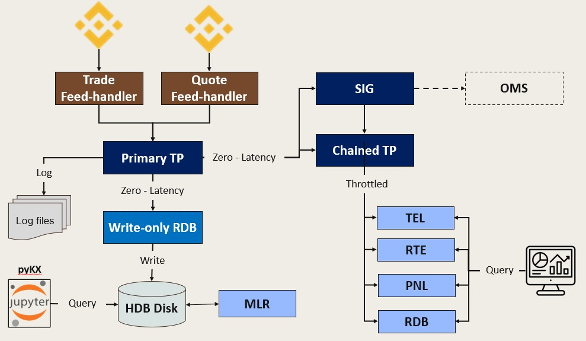
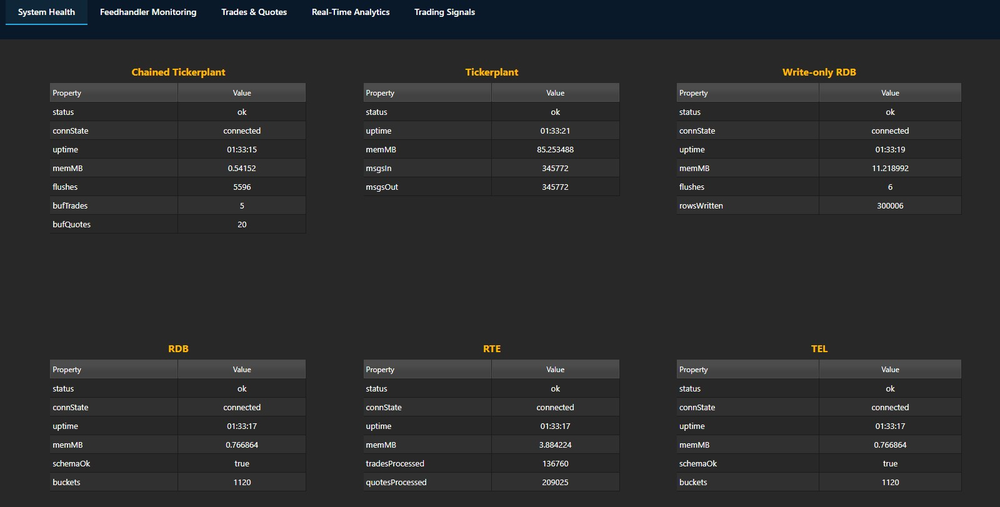
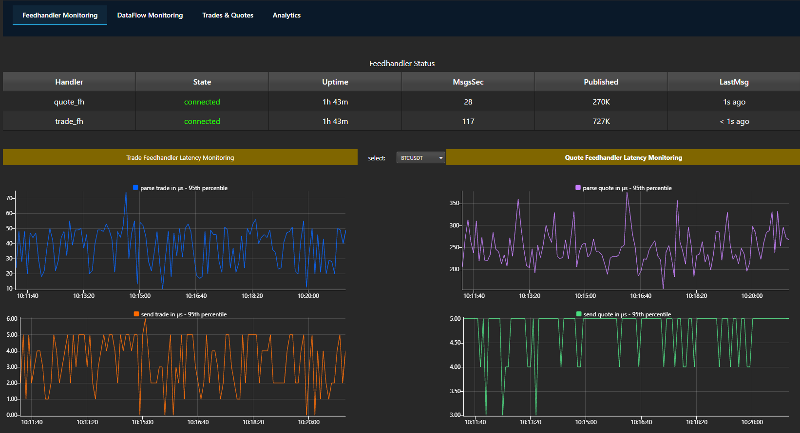
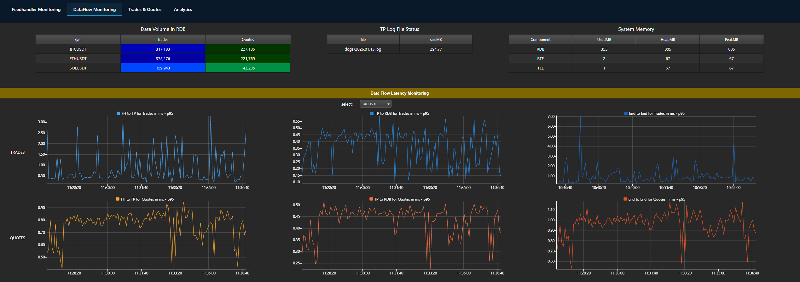
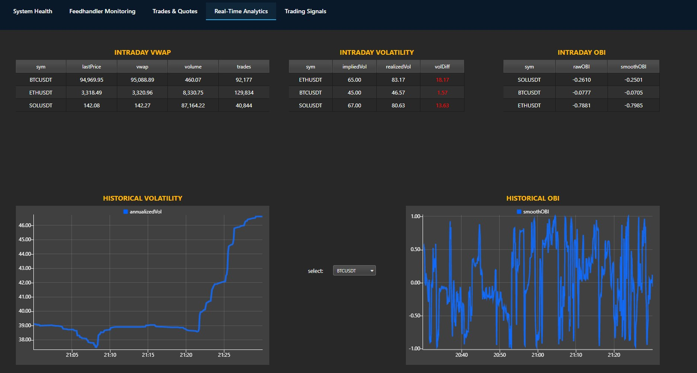
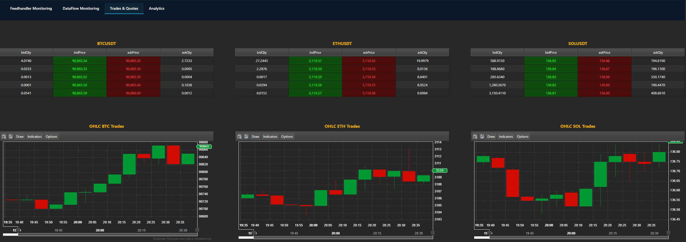
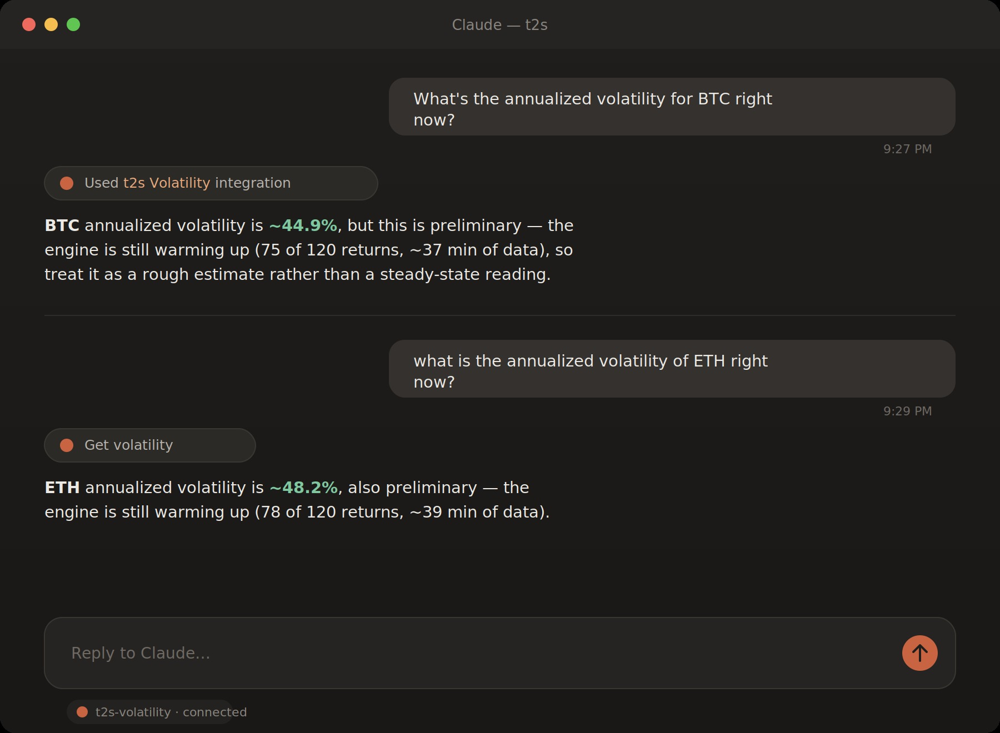

# Tick to Signal

A real-time Binance market data pipeline built with C++ and KDB-X. Three feed handlers (spot trades, USD-M futures aggTrades, L5 order book) stream into a tickerplant-fanout architecture with batched analytics, RSI-based signal generation, simulated P&L tracking, and durability-log replay (WDB recovers from disconnects). A historical data store (`hdb_binancedata/`) supports offline research and feature-engineering primitives drawn from López de Prado's *Advances in Financial Machine Learning*.

Architecture patterns originally inspired by *Building Real-Time Event-Driven KDB-X Systems* by Data Intellect; extended with TLS-verified WS/REST, TCP keepalive and dead-connection detection, per-stream sequence-gap surfacing, Binance-spec-correct order book reconciliation, async snapshot fetching, replay-on-reconnect, RAII-managed kdb+ IPC, drop-and-count JSON parsing, and a multi-language test suite. A read-only MCP server (`mcp/`) additionally exposes the live analytics for natural-language querying through Claude Desktop.

## Architecture



Each downstream process auto-reconnects with exponential backoff. The TP writes a durability log per day. **WDB persists a checkpoint and replays missed data from the durability log on reconnect** (Phase 4); other subscribers (CTP, RDB, RTE, TEL, SIG, PNL) are best-effort live analytics that may have gaps after disconnect. Feed handler TLS connections to Binance are fully verified (peer cert + hostname), use TCP keepalive plus a 30s WebSocket idle timeout to detect dead connections within ~90s, and TP tracks per-stream sequence-number gaps so missed messages are surfaced rather than silent.

## Components

| Component    | Port  | Subscribes to | Role                                                   |
|--------------|-------|---------------|--------------------------------------------------------|
| Trade FH     | —     | Binance WS    | Spot trade feed handler (C++)                          |
| Trade FH Fut | —     | Binance WS    | USD-M futures aggTrade feed handler (C++)              |
| Quote FH     | —     | Binance WS    | L5 order book feed handler (C++) with REST snapshots   |
| TP           | 5010  | FHs           | Tickerplant — pub/sub hub with daily durability log    |
| CTP          | 5014  | TP            | Chained tickerplant — 1s batching for downstream fanout|
| WDB          | 5011  | TP            | Write-only DB — buffers and writes to HDB at EOD       |
| RDB          | 5017  | CTP           | Real-time DB — in-memory queries, 60min retention      |
| RTE          | 5015  | CTP           | Analytics — VWAP, realized vol, OBI (EMA-smoothed)     |
| TEL          | 5016  | CTP           | Telemetry — feed handler latency aggregation           |
| SIG          | 5012  | TP, CTP       | RSI signal generator — publishes positions to CTP      |
| PNL          | 5018  | CTP           | P&L and position monitoring                            |
| MLE          | 5032  | TP            | ML engine (research, not auto-started) — dollar-imbalance bars, threshold adaptation |

The table above describes the live ingestion + analytics pipeline. Research-side code (`kdb/framework/` — backtest framework, `kdb/strategies/` — strategy files, `kdb/ml/` — feature engineering) is run on-demand against the historical HDB, not as long-running processes. See **Backtest Framework** and **Research Workflow** below.

## The System in Action

**System Health Monitoring** — Health status of main processes.



**Feed Handler Monitoring** — Feedhandler latency metrics for trade and quote ingestion.



**Dataflow Monitoring** — Data volume, system resources, and end-to-end latency breakdown.



**Analytics** — VWAP, Volatility, Order Book Imbalance.



**Trades & Quotes** — Live order books and OHLC charts per symbol.



## Project Layout

```
t2s/
├── cpp/                      # Feed handlers (C++)
│   ├── include/              # Public headers
│   │   ├── config.hpp                # JSON config loader for FH binaries
│   │   ├── json_reader.hpp           # Safe accessors for rapidjson (no-throw, type-checked)
│   │   ├── k_object.hpp              # RAII wrappers for kdb+ K objects (KOwned/KBorrowed)
│   │   ├── logger.hpp                # spdlog setup helper
│   │   ├── market_config.hpp         # Market shape (host, port, stream suffix, schema) shared by spot + futures trade FH
│   │   ├── order_book_manager.hpp    # L5 book reconstruction + state machine
│   │   ├── quote_feed_handler.hpp    # Quote FH class declaration
│   │   ├── rest_client.hpp           # HTTPS client for Binance REST (snapshots)
│   │   ├── snapshot_worker.hpp       # Async snapshot fetcher (worker thread + bounded queue)
│   │   ├── socket_utils.hpp          # TCP keepalive helper
│   │   ├── trade_feed_handler.hpp    # Trade FH class declaration (schema-branched: spot trade / futures aggTrade)
│   │   └── trade_row.hpp             # buildTradeRow helper (schema-driven K-object construction)
│   ├── src/                  # Implementations + main entry points
│   │   ├── quote_feed_handler.cpp    # Quote FH class implementation
│   │   ├── quote_fh_main.cpp         # Quote FH binary entry point
│   │   ├── trade_feed_handler.cpp    # Trade FH class implementation (both schemas)
│   │   ├── trade_fh_main.cpp         # Spot trade FH binary entry point
│   │   └── trade_fh_fut_main.cpp     # Futures aggTrade FH binary entry point
│   └── third_party/
│       ├── catch2/                   # Vendored Catch2 v3 amalgamation (C++ tests)
│       └── kdb/                      # k.h and c.o for kdb+ IPC
├── kdb/
│   ├── schemas.q             # Shared table schemas (single source of truth, includes futures aggTrade)
│   ├── tick/                 # Tickerplant chain
│   │   ├── tp.q              # Primary tickerplant (durability log)
│   │   ├── chained_tp.q      # Batched fanout to downstream
│   │   ├── rdb.q             # Real-time DB
│   │   └── wdb.q             # Write-only DB → HDB
│   ├── analytics/            # Real-time analytics
│   │   ├── rte.q             # VWAP, vol, OBI
│   │   ├── tel.q             # Latency telemetry
│   │   ├── sig.q             # RSI signals
│   │   ├── pnl.q             # P&L tracking
│   │   └── mle.q             # ML engine (dollar-imbalance bars)
│   ├── ml/                   # ML feature pipeline (in progress)
│   │   ├── afml.q            # AFML primitives (López de Prado)
│   │   ├── features.q        # Feature engineering (dollar-imbalance bars, etc.)
│   │   └── labels.q          # Labeling primitives for supervised learning
│   ├── framework/            # Backtest framework (v0.1) — see Backtest Framework section
│   │   ├── backtest.q        # Top-level orchestrator: loads strategy + replays history, prints report
│   │   ├── framework.q       # Event loop, callback dispatch, virtual clock, intent routing
│   │   ├── pretrade.q        # Pre-trade gate: position-size cap, kill-switch enforcement
│   │   ├── execution.q       # Paper-fill simulator: synthetic spread + Binance USDS-M fees
│   │   ├── position.q        # Position tracking, P&L, funding application, auto-exit policies
│   │   └── replay.q          # Historical replay driver: HDB → framework events
│   ├── strategies/           # Strategy files that plug into the framework
│   │   └── momentum.q        # Example: fast/slow EMA crossover, long-flat, no embedded stops
│   ├── pubsub/               # KDB-X di.pubsub module
│   │   ├── init.q            # Module bootstrap: defines subscribable tables, fetches schemas
│   │   └── pubsub.q          # subscribe/publish primitives + utilities (sub clear, EOD/EOP broadcast)
│   └── utils/                # Operational tooling
│       ├── tradeLoader.q          # Historical spot trade loader (single-date or date range, interactive or scripted)
│       ├── aggTradeLoaderFut.q    # Historical USD-M futures aggTrade loader (mirrors tradeLoader.q)
│       ├── tradeLoaderFut.q       # Historical USD-M futures per-fill trade loader (finer granularity than aggTrade)
│       ├── fundingLoader.q        # Funding rate loader (incremental, paginated, splayed)
│       ├── hdbUtils.q             # HDB switching, queries
│       └── logmgr.q               # Durability log management
├── tests/                    # Test suite (bash + q + C++)
│   ├── run_tests.sh                     # Test runner - dispatches .q, .sh, and build/test_* binaries
│   ├── t_lib.q                          # Shared assertion + sandbox helpers
│   ├── test_schemas.q                   # Schema integrity assertions
│   ├── test_afml.q                      # Q tests for kdb/ml/afml.q primitives
│   ├── test_labels.q                    # Q tests for kdb/ml/labels.q primitives
│   ├── test_smoke.sh                    # Per-process load + .health[] smoke test
│   ├── test_wdb_eod.sh                  # End-to-end WDB EOD persistence test
│   ├── wdb_eod_body.q                   # Q assertions invoked by test_wdb_eod.sh
│   ├── test_order_book.cpp              # C++ unit tests for OrderBookManager (Catch2)
│   ├── test_snapshot_worker.cpp         # C++ unit tests for SnapshotWorker (Catch2)
│   ├── test_json_reader.cpp             # C++ unit tests for JsonReader + parseLevelPair (Catch2)
│   ├── test_trade_fh_row_construction.cpp   # C++ unit tests for buildTradeRow (both schemas)
│   ├── test_stream_path.cpp             # C++ unit tests for buildStreamPath (combined-stream URL builder)
│   └── test_aggtrade_parse.cpp          # C++ unit tests for futures aggTrade JSON parsing
├── mcp/                      # MCP server — conversational query surface (Python sidecar)
│   ├── server.py             # get_volatility tool → calls .rte.getVol[] over IPC
│   ├── requirements.txt      # mcp, pykx
│   └── README.md             # setup + Claude Desktop wiring notes
├── config/                   # Feed handler JSON configs
│   ├── trade_feed_handler.json       # Spot trade FH
│   ├── trade_feed_handler_fut.json   # USD-M futures aggTrade FH
│   └── quote_feed_handler.json       # L5 quote FH
├── dashboards/               # KX Dashboards (Analytics, DataFlow, FH, Trades/Quotes)
├── hdb/                      # Live HDB partitions (gitignored, populated at EOD)
├── tmp/                      # WDB intraday writedown directory (gitignored)
├── hdb_binancedata/          # Historical research HDB (gitignored)
├── notebooks/                # Jupyter research notebooks
├── markdown_docs/            # Design notes, guides
├── run/                      # Runtime status files written by start.sh (gitignored)
├── CMakeLists.txt
├── install_kdb.sh
├── check_eod.sh              # Post-midnight verification script (HDB partition + WDB logs)
├── start.sh                  # Start all (tmux) — supports --markets {spot|futures|spot,futures}
└── stop.sh                   # Stop all
```

## Prerequisites

- kdb+ 4.x or KDB-X (with `di.pubsub` module)
- C++17 compiler, CMake 3.16+
- Boost (Beast, Asio), OpenSSL, RapidJSON, spdlog

On Ubuntu/WSL the system libraries can be installed with:
```bash
sudo apt update
sudo apt install -y build-essential cmake \
    libboost-system-dev libssl-dev libspdlog-dev rapidjson-dev
```

A helper script `install_kdb.sh` is provided for kdb+ setup.

Catch2 is optional (only used to build the C++ test binaries). If `cpp/third_party/catch2/catch_amalgamated.{hpp,cpp}` is present, the test targets are built; otherwise CMake prints a notice and skips them. Download the amalgamated headers from https://github.com/catchorg/Catch2/releases (v3.x).

## Build

```bash
cmake -S . -B build
cmake --build build
```

This produces three binaries: `trade_feed_handler` (spot), `trade_feed_handler_fut` (USD-M futures aggTrade), and `quote_feed_handler`.

## Run

Start everything via tmux:
```bash
./start.sh                          # spot only (backward-compat default)
./start.sh --markets spot           # explicit spot only
./start.sh --markets futures        # futures aggTrade only
./start.sh --markets spot,futures   # both
```

Stop everything:
```bash
./stop.sh
```

`start.sh` brings up TP, CTP, WDB, RDB, RTE, TEL, SIG, PNL plus the feed handlers selected by `--markets`. The futures FH is `trade_feed_handler_fut`; it loads `config/trade_feed_handler_fut.json` and ingests `@aggTrade` events into the `trade_binance_fut` table alongside spot trades. MLE is research-only and is started manually when needed:
```bash
q kdb/analytics/mle.q
```

Individual processes can also be started manually. From the project root:
```bash
q kdb/tick/tp.q
q kdb/tick/chained_tp.q
q kdb/tick/wdb.q
q kdb/tick/rdb.q
q kdb/analytics/rte.q
q kdb/analytics/tel.q
q kdb/analytics/sig.q
q kdb/analytics/pnl.q
./build/trade_feed_handler config/trade_feed_handler.json
./build/trade_feed_handler_fut config/trade_feed_handler_fut.json
./build/quote_feed_handler config/quote_feed_handler.json
```

The feed handler binaries take a config file path as their only argument. If invoked with no argument (as `start.sh` does), each falls back to `config/<binary_name>.json` relative to the working directory, which is why `start.sh` runs them without an explicit path after `cd $BASEDIR`. To run from elsewhere, pass the config explicitly as shown above.

## Configuration

Feed handler runtime config lives in `config/`:

- `trade_feed_handler.json` — spot trade FH: symbols, TP host/port, reconnect backoff, log level/file
- `trade_feed_handler_fut.json` — USD-M futures aggTrade FH: same shape, but with `host=fstream.binance.com`, `port=443`, `stream_suffix=@aggTrade`, `tp_table=trade_binance_fut`, `schema=futures_agg_trade`
- `quote_feed_handler.json` — same fields, used by the L5 quote handler

Each q process has its own config block at the top of its file (e.g. `.tp.cfg`, `.rdb.cfg`). Edit and reload to change ports, retention, batch intervals, etc.

Pipeline-wide table schemas live in `kdb/schemas.q` and are loaded by every q process. Adding or modifying a column there propagates everywhere on the next restart; field indices used by TP gap detection, TEL latency parsing, and RTE analytics are all derived from the schema (no magic numbers).

## Tests

Run the full suite from the project root:
```bash
./tests/run_tests.sh
```

The runner discovers `tests/test_*.q`, `tests/test_*.sh`, and any compiled binaries at `build/test_*`, then reports pass/fail per file. Current coverage:

- **`test_schemas.q`** — schemas.q column counts, types, and derived index positions. Catches accidental schema changes that would break the rest of the pipeline.
- **`test_afml.q`** — Q tests for AFML primitives in `kdb/ml/afml.q`.
- **`test_labels.q`** — Q tests for labeling primitives in `kdb/ml/labels.q`.
- **`test_smoke.sh`** — starts each q process (tp, ctp, rdb, wdb, sig, pnl, rte, tel) in isolation against test ports, asserts `.health[]` returns a sane response. Catches load-time errors and missing `.health[]` interface.
- **`test_wdb_eod.sh`** — full TP→WDB integration test: publishes synthetic data, forces EOD, verifies a partition lands in the sandbox HDB with correct row counts. Validates the EOD persistence path end-to-end.
- **`build/test_order_book`** — C++ unit tests (Catch2) for `OrderBookManager`: state machine (INIT→SYNCING→VALID→INVALID), snapshot truncation/padding, delta semantics (insert/update/delete via qty=0), sequence-gap detection, multi-symbol independence, and Binance-spec compliance for overlapping deltas, boundary cases, and entirely-stale events.
- **`build/test_snapshot_worker`** — C++ unit tests (Catch2) for `SnapshotWorker`: bounded-queue semantics, drop-oldest on overflow, worker thread lifecycle, request-id stale-result discard, shutdown signalling.
- **`build/test_json_reader`** — C++ unit tests (Catch2) for `JsonReader` and `parseLevelPair`: missing keys, wrong types, malformed numeric strings, nested-object error propagation, first-error-wins semantics, and level-array edge cases (wrong shape, non-string elements, unparseable content, future-compat with extra elements).
- **`build/test_trade_fh_row_construction`** — C++ unit tests (Catch2) for `buildTradeRow`: schema-driven K-object construction for both spot trade and futures aggTrade payloads, FH observation-stamp population, type correctness across all columns.
- **`build/test_stream_path`** — C++ unit tests (Catch2) for `buildStreamPath`: combined-stream URL assembly for one or many symbols with arbitrary stream suffixes.
- **`build/test_aggtrade_parse`** — C++ unit tests (Catch2) for futures aggTrade JSON parsing: required-field extraction (`a`/`f`/`l`/`p`/`q`/`T`/`m`), missing-field handling, type-mismatch behaviour.

C++ tests are built when `cpp/third_party/catch2/catch_amalgamated.{hpp,cpp}` are present (download from https://github.com/catchorg/Catch2/releases).

Tests run on isolated ports (production + 10000) so they're safe to run while the live pipeline is up. Sandbox state goes under `tests/sandbox/` and is auto-cleaned on success, preserved on failure for inspection.

## Query Interfaces

Connect with `q -p` or any kdb+ client. A few examples:

```q
// RDB (port 5017) — recent trades and quotes
select from trade_binance where sym=`BTCUSDT
.rdb.tradeSummary[]
.rdb.lastQuotes[10]

// RTE (port 5015) — analytics
.rte.getVwap[]
.rte.getOBI[`smooth]
.rte.getOBIHistory[`BTCUSDT;30]
.rte.getVolComparison[]

// TEL (port 5016) — feed handler latency
.tel.vsFhStatus[]

// TP (port 5010) — durability log status, sequence tracking, replay
.tp.statusDict[]              / counters: gaps, dups, tpSeqNo, log chunks
.tp.lastAccepted[`trade]      / highest fhSeqNo accepted from trade FH
.tp.currentSeqNo[]            / current monotonic tpSeqNo
.tp.replayFrom[`trade_binance; fromSeq]   / replay slice from log

// WDB (port 5011) — Phase 4 replay state
.wdb.replayStatus[]           / lastTpSeqNo, replayMode, replay counters

// PNL (port 5018) — positions and P&L
// (see kdb/analytics/pnl.q for the query interface)

// All processes — standardized health check
.health[]
```

WDB persists its replay checkpoint to `$T2S_TMP_DIR/wdb.lastTpSeqNo` after every successful flush. On restart, it loads this and asks TP to replay everything since, so disk-persisted data is recoverable across WDB or TP restarts.

## Conversational Query Interface (MCP)

The analytics are also reachable in plain English through an [MCP](https://modelcontextprotocol.io) server (`mcp/server.py`), which exposes the live RTE process to an MCP host such as Claude Desktop. Instead of opening a q session and calling `.rte.getVol[]`, you can ask:



The server is a **read-only sidecar**: a separate Python process that connects to RTE (port 5015) as an ordinary kdb+ IPC client via [PyKX](https://code.kx.com/pykx/), so it sits alongside the pipeline and is never in the tick hot path. It recomputes nothing — each tool call invokes an existing q function and returns the result as structured data. The current tool, `get_volatility`, wraps `.rte.getVol[]`:

- `get_volatility(symbol)` returns that symbol's current annualized realized volatility (case-insensitive, e.g. `BTCUSDT`).
- `get_volatility()` with no symbol returns volatility for all tracked symbols.

Each result carries `annualizedVol`, `returnCount`, and `isValid`, plus a readable note. Because vol is computed over a fixed 60-minute rolling window (~120 samples at one per 30s), `isValid` is only `true` once that window is fully loaded; readings in the first ~60 minutes after startup (or after an EOD reset) are returned but flagged as warming up, so a preliminary estimate is never mistaken for a steady-state one.

**Setup.** Install the dependencies into the project venv, then point an MCP host at the server:

```bash
cd mcp
python -m pip install -r requirements.txt   # mcp; pykx assumed present (KDB-X)
```

For Claude Desktop on Windows + WSL, the server is registered as a local MCP extension that launches the WSL-side process:

```
command:  wsl.exe
args:     -d Ubuntu-22.04 --exec bash -lc
          "/home/<user>/t2s/.venv/bin/python /home/<user>/t2s/mcp/server.py"
```

With RTE running, the host discovers the `get_volatility` tool and routes natural-language volatility questions to it, while general questions (e.g. "what *is* annualized volatility?") are answered from the model's own knowledge without a tool call. See `mcp/README.md` for full wiring and troubleshooting notes.

The server is intentionally minimal — one read-only tool — but the pattern extends directly to the other RTE query functions (`.rte.getOBI`, `.rte.getSpread`, `.rte.getOrderBook`) and to the history functions (`.rte.getVolHistory`, `.rte.getOBIHistory`), which return time series suitable for charting.

## Dashboards

Four KX Dashboard JSONs are provided in `dashboards/`:

- `TradesQuotes.json` — live trade and quote tables
- `Analytics.json` — VWAP, volatility, OBI charts
- `FeedhandlerMonitoring.json` — FH connection state and message rates
- `DataFlowMonitoring.json` — per-process throughput across the pipeline

Import into KX Dashboards and point each panel at the appropriate process port.

## Backtest Framework

A research tool that replays historical market data through a user-written strategy under realistic cost assumptions. Lives in `kdb/framework/` (the engine, six files) and `kdb/strategies/` (individual strategy files). Designed so strategy authors write only alpha logic; the framework owns position tracking, risk, and execution simulation.

**Four-layer architecture:**

1. **Strategy** (in `kdb/strategies/`) — pure alpha. Reacts to market events via callbacks, emits trading *intents*. Does not place orders directly, does not track position, does not implement stops.
2. **Pre-trade checks** (`pretrade.q`) — validates every intent before it becomes a fill. v0.1 rules: max position size per symbol, kill-switch enforcement.
3. **Execution** (`execution.q`) — paper-fill simulator. Synthesizes bid/ask from last trade price plus a configurable half-spread. Applies Binance USDS-M Regular fees (0.05% taker, 0.02% maker, optional 10% BNB discount).
4. **Position tracking** (`position.q`) — single source of truth for current state: net position, cost basis, realized/unrealized P&L, fees paid, funding paid. Applies funding charges at each 8h boundary (00:00, 08:00, 16:00 UTC) from the loaded funding history. Runs auto-exit policies (stop-loss, kill switch) which emit forced-exit intents back through the same pipeline.

The replay driver (`replay.q`) loads splayed trade data + funding events from `hdb_binancedata/` and dispatches them to the framework in time order; the framework's virtual clock injects funding events at the right moments. In a future live runner, a CTP subscription would take `replay.q`'s place — same framework, different driver.

**Strategy contract.** A strategy is a q file that defines callbacks in its own namespace:

```q
.strat.myStrategy.init     [cfg]                -> state                   // required
.strat.myStrategy.onTrade  [state; tradeEvent]  -> (newState; intents)     // required
.strat.myStrategy.onFill   [state; fillEvent]   -> newState                // optional
.strat.myStrategy.onTimer  [state; ts]          -> (newState; intents)     // optional
.strat.myStrategy.onFunding[state; fundingEv]   -> newState                // optional
```

State is whatever shape the strategy wants (the framework holds it and passes it back). Intents are tagged dicts: `` `action`sym`qty`source!(`buy|`sell|`flatten; `BTCUSDT; 0.1; `strategy) ``.

**Running a backtest:**

```bash
# Default: BTCUSDT, 2026-06-06, aggTrade_fut, momentum strategy
q kdb/framework/backtest.q

# With strategy parameter overrides (any unknown flag is forwarded to the strategy's cfg)
q kdb/framework/backtest.q -fastN 10000 -slowN 50000 -tradeQty 0.1

# Different symbol / date / data granularity
q kdb/framework/backtest.q -sym BTCUSDT -start 2026.06.01 -end 2026.06.07 -table trade_fut
```

The runner loads the framework, calls the strategy's `init`, dispatches every event in the historical range, and prints a position report with gross P&L, fees, funding, and net.

**v0.1 limitations** worth knowing before designing strategies against this:

- Single strategy per run (architecture supports multi-strategy; example doesn't exercise it)
- Single-symbol example (architecture supports multi-symbol)
- Market orders only — no limit-order support
- No size impact in fills (any size fills at the same synthetic price)
- No partial fills
- Kill switch is one-shot (resets only on process restart)
- Equity-curve output is final-only; no per-tick time series saved

## Research Workflow

The historical side of the project supports offline analysis and ML research against partitioned trade data.

**Loading historical data.** Three loaders live in `kdb/utils/` and share the same shape (interactive REPL or `-range` scripted mode, `BINANCE_DOWNLOAD_DIR` / `HDB_BINANCE_DIR` env vars, idempotent on existing partitions, polite-sleep between dates).

- **`tradeLoader.q`** downloads spot trade dailies from `data.binance.vision/data/spot/daily/trades/` into a `trade` table.
- **`aggTradeLoaderFut.q`** downloads USD-M futures aggTrade dailies from `data.binance.vision/data/futures/um/daily/aggTrades/` into an `aggTrade_fut` table. Matches the live pipeline's granularity (the `@aggTrade` WebSocket stream).
- **`tradeLoaderFut.q`** downloads USD-M futures per-fill trades from `data.binance.vision/data/futures/um/daily/trades/` into a `trade_fut` table. Finer granularity than the live stream provides — there is no `@trade` endpoint for futures — but useful for microstructure research where individual fill timing matters. Files are 3–10× larger than the equivalent aggTrade archive.

Both futures loaders write under `hdb_binancedata/<date>/` as sibling tables (`aggTrade_fut/`, `trade_fut/`), so a single date can host both granularities side by side. Schemas in the research HDB deliberately omit observation columns (`fhRecvTimeUtcNs`, `tpSeqNo`, etc.) that exist only in the live HDB.

Two ways to use any loader:

```bash
# Interactive: defines functions, drops into REPL
q kdb/utils/tradeLoader.q
q kdb/utils/aggTradeLoaderFut.q
q kdb/utils/tradeLoaderFut.q
```

```q
downloadAndLoad[2026.01.17; `BTCUSDT`ETHUSDT`SOLUSDT]
downloadAndLoadRange[2026.01.10; 2026.01.20; `BTCUSDT`ETHUSDT]
```

```bash
# Scripted: runs the range non-interactively, exits when done
q kdb/utils/tradeLoader.q       -range 2026.01.10 2026.01.20 BTCUSDT,ETHUSDT
q kdb/utils/aggTradeLoaderFut.q -range 2026.06.01 2026.06.07 BTCUSDT
q kdb/utils/tradeLoaderFut.q    -range 2026.06.01 2026.06.07 BTCUSDT
```

Range mode skips dates whose partition already exists (so backfills are idempotent), polite-sleeps between downloads to respect Binance rate limits, continues on per-date failures, and prints a summary of loaded/skipped/failed dates at the end.

**Querying the HDB.** `kdb/utils/hdbUtils.q` provides switch-and-query helpers:

```q
\l kdb/utils/hdbUtils.q
.hdb.use[`:hdb_binancedata]
.hdb.tables[]
.hdb.dateRange[]
.hdb.rowCounts[`trade; 2026.01.14; 2026.01.20]
.hdb.loadBySym[`trade; `BTCUSDT; 2026.01.14; 2026.01.20]
```

**ML feature pipeline (in progress).** `kdb/ml/` contains an in-progress implementation of feature engineering primitives from López de Prado's *Advances in Financial Machine Learning*. Currently includes dollar-imbalance bars (`afml.q`, `features.q`) — see `markdown_docs/dollar_imbalance_bars_guide.md` for design notes. Expect breaking changes.

**Notebooks.** Jupyter notebooks for ad-hoc analysis live in `notebooks/`. They connect to the running processes or directly to the HDB.

## Documentation

- `markdown_docs/` — design notes, intraday writedown patterns, compression notes, dollar-imbalance bars guide
- Architecture Decision Records and the project white paper: [tick-to-signal-docs](https://github.com/PhilSing24/tick-to-signal-docs)
- Inline ADR references in C++ headers (`@see docs/decisions/adr-NNN-*.md`) point to the docs repo above

## Known Gaps

The ML pipeline (`kdb/ml/`) is actively developed and APIs may change. The live tick pipeline is the stable, primary deliverable.

C++ unit tests currently cover `OrderBookManager` (23 cases, 98 assertions), `SnapshotWorker` (13 cases, 51 assertions), `JsonReader` (17 cases, 51 assertions), plus narrower units of the trade FH path: `buildTradeRow` (both schemas), `buildStreamPath`, and futures aggTrade parsing. The end-to-end FH classes themselves are still exercised via the live pipeline rather than in isolated tests. Trade output was end-to-end validated against the Binance Vision archive on 2026-05-09 (1,002,373 BTCUSDT trades, byte-identical modulo µs/ms timestamp resolution — Binance Vision archives carry microsecond precision, the WebSocket stream publishes milliseconds). Futures aggTrade output was validated against the Binance Vision archive on 2026-06-06 (2,274,464 BTCUSDT aggTrades, full UTC day span).

WDB replay-on-reconnect (Phase 4) reads only the current day's durability log. Disconnects spanning midnight UTC will not catch up data from the prior day — operationally rare on a single machine, but a known limitation.

HDB partitions written before ADR-013 step 6 do not contain a `trade_binance_fut/` splay. HDB-wide queries on the futures table will fail until those older partitions are backfilled with empty splays (pending follow-up); direct splay queries by date already work.

## License

MIT — see [LICENSE](LICENSE) file.
