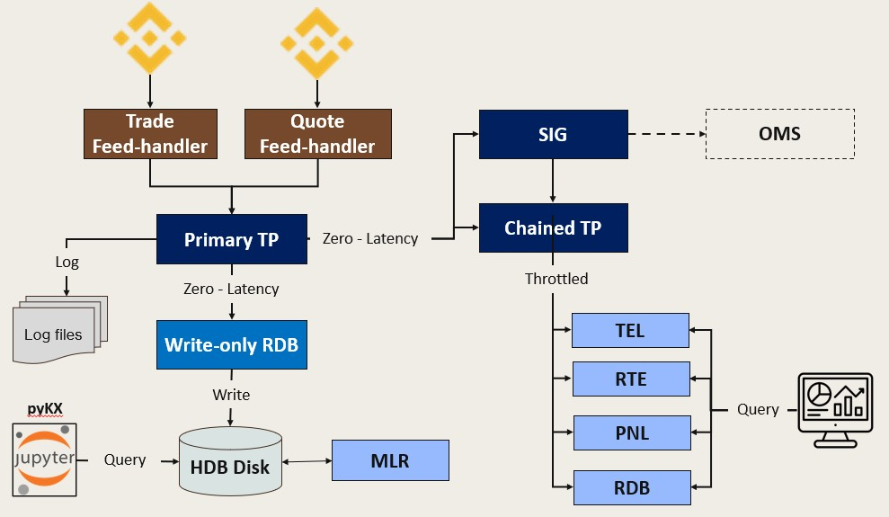
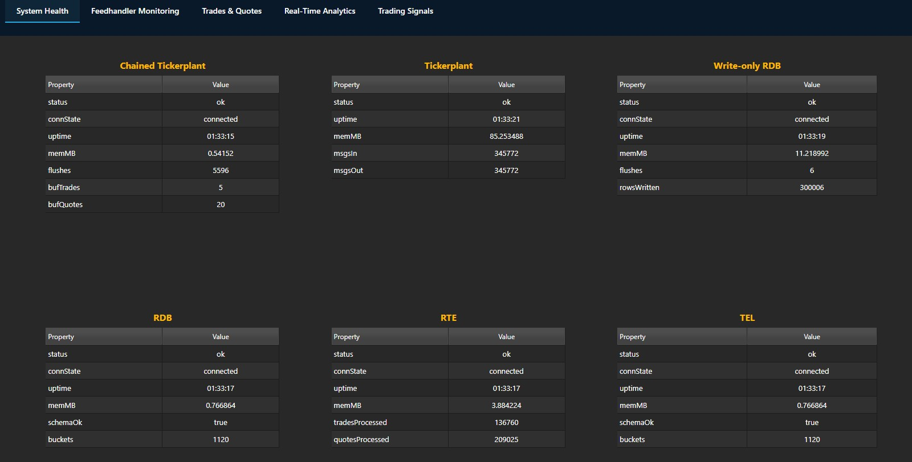
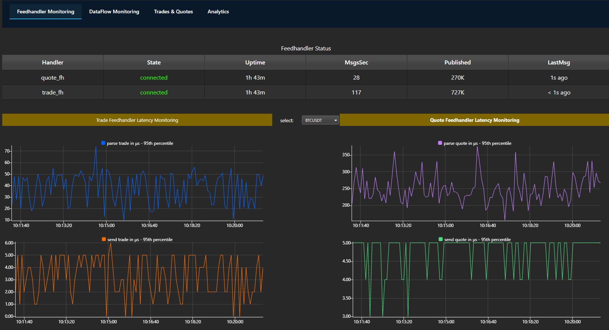
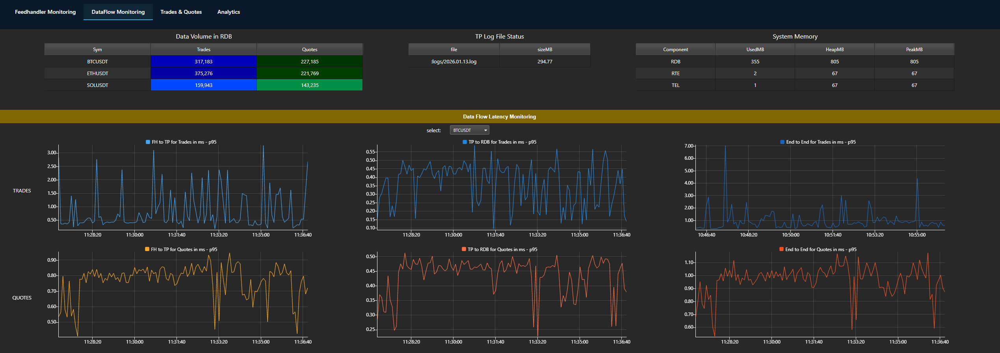
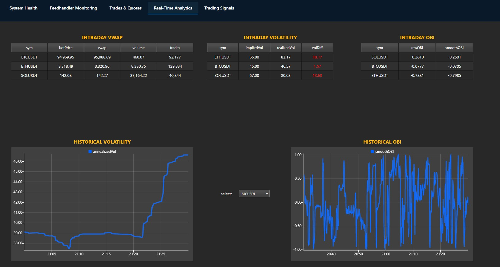
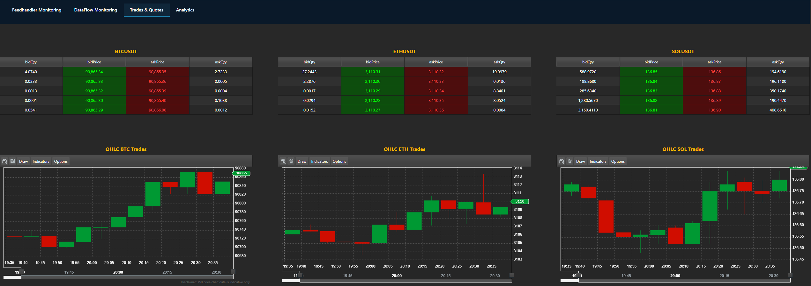

# Tick to Signal

A real-time Binance market data pipeline built with C++ and KDB-X. Three feed handlers (spot trades, USD-M futures aggTrades, L5 order book) stream into a tickerplant-fanout architecture with batched analytics, RSI-based signal generation, simulated P&L tracking, and durability-log replay (WDB recovers from disconnects). A historical data store (`hdb_binancedata/`) supports offline research and feature-engineering primitives drawn from López de Prado's *Advances in Financial Machine Learning*.

Architecture patterns originally inspired by *Building Real-Time Event-Driven KDB-X Systems* by Data Intellect; extended with TLS-verified WS/REST, TCP keepalive and dead-connection detection, per-stream sequence-gap surfacing, Binance-spec-correct order book reconciliation, async snapshot fetching, replay-on-reconnect, RAII-managed kdb+ IPC, drop-and-count JSON parsing, and a multi-language test suite. A read-only MCP server (`mcp/`) additionally exposes the live analytics for natural-language querying through Claude Desktop.

## Architecture



Each downstream process auto-reconnects with exponential backoff. The TP writes a durability log per day. **WDB persists a checkpoint and replays missed data from the durability log on reconnect**; other subscribers (CTP, RDB, RTE, TEL, SIG, PNL) are best-effort live analytics that may have gaps after disconnect. Feed handler TLS connections to Binance are fully verified (peer cert + hostname), use TCP keepalive plus a 30s WebSocket idle timeout to detect dead connections within ~90s, and TP tracks per-stream sequence-number gaps so missed messages are surfaced rather than silent.

## Components

| Component    | Port  | Subscribes to | Role                                                   |
|--------------|-------|---------------|--------------------------------------------------------|
| Trade FH     | —     | Binance WS    | Spot trade feed handler (C++)                          |
| Trade FH Fut | —     | Binance WS    | USD-M futures aggTrade feed handler (C++)              |
| Quote FH     | —     | Binance WS    | L5 order book feed handler (C++) with REST snapshots   |
| TP           | 5010  | FHs           | Tickerplant — pub/sub hub with daily durability log    |
| WDB          | 5011  | TP            | Write-only DB — buffers and writes to HDB at EOD       |

The table above describes the live ingestion pipeline. Research-side code (`kdb/framework/` — backtest framework, `kdb/strategies/` — strategy files, `kdb/ml/` — feature engineering) is run on-demand against the historical HDB, not as long-running processes. See **Backtest Framework** and **Research Workflow** below.

## The System in Action

**System Health Monitoring** — Health status of main processes.



**Feed Handler Monitoring** — Feedhandler latency metrics for trade and quote ingestion.



**Dataflow Monitoring** — Data volume, system resources, and end-to-end latency breakdown.



**Analytics** — VWAP, Volatility, Order Book Imbalance.



**Trades & Quotes** — Live order books and OHLC charts per symbol.



## Project Layout

```
t2s/
├── cpp/                      # Feed handlers (C++)
│   ├── include/              # Public headers
│   │   ├── config.hpp                # JSON config loader for FH binaries
│   │   ├── json_reader.hpp           # Safe accessors for rapidjson (no-throw, type-checked)
│   │   ├── k_object.hpp              # RAII wrappers for kdb+ K objects (KOwned/KBorrowed)
│   │   ├── logger.hpp                # spdlog setup helper
│   │   ├── market_config.hpp         # Market shape (host, port, stream suffix, schema) shared by spot + futures trade FH
│   │   ├── order_book_manager.hpp    # L5 book reconstruction + state machine
│   │   ├── quote_feed_handler.hpp    # Quote FH class declaration
│   │   ├── rest_client.hpp           # HTTPS client for Binance REST (snapshots)
│   │   ├── snapshot_worker.hpp       # Async snapshot fetcher (worker thread + bounded queue)
│   │   ├── socket_utils.hpp          # TCP keepalive helper
│   │   ├── trade_feed_handler.hpp    # Trade FH class declaration (schema-branched: spot trade / futures aggTrade)
│   │   └── trade_row.hpp             # buildTradeRow helper (schema-driven K-object construction)
│   ├── src/                  # Implementations + main entry points
│   │   ├── quote_feed_handler.cpp    # Quote FH class implementation
│   │   ├── quote_fh_main.cpp         # Quote FH binary entry point
│   │   ├── trade_feed_handler.cpp    # Trade FH class implementation (both schemas)
│   │   ├── trade_fh_main.cpp         # Spot trade FH binary entry point
│   │   └── trade_fh_fut_main.cpp     # Futures aggTrade FH binary entry point
│   └── third_party/
│       ├── catch2/                   # Vendored Catch2 v3 amalgamation (C++ tests)
│       └── kdb/                      # k.h and c.o for kdb+ IPC
├── kdb/
│   ├── schemas.q             # Shared table schemas (single source of truth, includes futures aggTrade)
│   ├── tick/                 # Tickerplant and writedown
│   │   ├── tp.q              # Primary tickerplant (durability log)
│   │   └── wdb.q             # Write-only DB → HDB
│   ├── ml/                   # ML feature pipeline (in progress)
│   │   ├── afml.q            # AFML primitives (López de Prado)
│   │   ├── features.q        # Feature engineering (dollar-imbalance bars, etc.)
│   │   └── labels.q          # Labeling primitives for supervised learning
│   ├── framework/            # Backtest framework (v0.1) — see Backtest Framework section
│   │   ├── backtest.q        # Top-level orchestrator: loads strategy + replays history, prints report
│   │   ├── framework.q       # Event loop, callback dispatch, virtual clock, intent routing
│   │   ├── pretrade.q        # Pre-trade gate: position-size cap, kill-switch enforcement
│   │   ├── execution.q       # Paper-fill simulator: synthetic spread + Binance USDS-M fees
│   │   ├── position.q        # Position tracking, P&L, funding application, auto-exit policies
│   │   └── replay.q          # Historical replay driver: HDB → framework events
│   ├── strategies/           # Strategy files that plug into the framework
│   │   └── momentum.q        # Example: fast/slow EMA crossover, long-flat, no embedded stops
│   ├── pubsub/               # KDB-X di.pubsub module
│   │   ├── init.q            # Module bootstrap: defines subscribable tables, fetches schemas
│   │   └── pubsub.q          # subscribe/publish primitives + utilities (sub clear, EOD/EOP broadcast)
│   └── utils/                # Operational tooling
│       ├── tradeLoader.q          # Historical spot trade loader (single-date or date range, interactive or scripted)
│       ├── aggTradeLoaderFut.q    # Historical USD-M futures aggTrade loader (mirrors tradeLoader.q)
│       ├── tradeLoaderFut.q       # Historical USD-M futures per-fill trade loader (finer granularity than aggTrade)
│       ├── fundingLoader.q        # Funding rate loader (incremental, paginated, splayed)
│       ├── hdbUtils.q             # HDB switching, queries
│       └── logmgr.q               # Durability log management
├── tests/                    # Test suite (bash + q + C++)
│   ├── run_tests.sh                     # Test runner - dispatches .q, .sh, and build/test_* binaries
│   ├── t_lib.q                          # Shared assertion + sandbox helpers
│   ├── test_schemas.q                   # Schema integrity assertions
│   ├── test_afml.q                      # Q tests for kdb/ml/afml.q primitives
│   ├── test_labels.q                    # Q tests for kdb/ml/labels.q primitives
│   ├── test_smoke.sh                    # Per-process load + .health[] smoke test
│   ├── test_wdb_eod.sh                  # End-to-end WDB EOD persistence test
│   ├── wdb_eod_body.q                   # Q assertions invoked by test_wdb_eod.sh
│   ├── test_order_book.cpp              # C++ unit tests for OrderBookManager (Catch2)
│   ├── test_snapshot_worker.cpp         # C++ unit tests for SnapshotWorker (Catch2)
│   ├── test_json_reader.cpp             # C++ unit tests for JsonReader + parseLevelPair (Catch2)
│   ├── test_trade_fh_row_construction.cpp   # C++ unit tests for buildTradeRow (both schemas)
│   ├── test_stream_path.cpp             # C++ unit tests for buildStreamPath (combined-stream URL builder)
│   └── test_aggtrade_parse.cpp          # C++ unit tests for futures aggTrade JSON parsing
├── config/                   # Feed handler JSON configs
│   ├── trade_feed_handler.json       # Spot trade FH
│   ├── trade_feed_handler_fut.json   # USD-M futures aggTrade FH
│   └── quote_feed_handler.json       # L5 quote FH
├── hdb/                      # Live HDB partitions (gitignored, populated at EOD)
├── tmp/                      # WDB intraday writedown directory (gitignored)
├── hdb_binancedata/          # Historical research HDB (gitignored)
├── markdown_docs/            # Design notes, guides
├── run/                      # Runtime status files written by start.sh (gitignored)
├── CMakeLists.txt
├── install_kdb.sh
├── check_eod.sh              # Post-midnight verification script (HDB partition + WDB logs)
├── start.sh                  # Start all (tmux) — supports --markets {spot|futures|spot,futures}
└── stop.sh                   # Stop all
```

## Operating it day to day

- `./start.sh --markets spot,futures` starts everything in the tmux session `t2s` and only returns once TP is healthy, WDB is connected with its replay complete, and every handler has registered with TP; `--headless` returns without attaching. `./stop.sh` stops handlers, then WDB (graceful flush and checkpoint), then TP, then tmux. `./status.sh` shows processes, health, rows today, the counters that matter, disk, pending tmp dirs and the clock, and exits non-zero when something needs attention. `./check_eod.sh [date]` confirms a closed day against its log.
- What happens on sleep, `wsl --shutdown` and Windows restart, the three ways to restart the pipeline automatically (Task Scheduler at logon, a systemd unit inside WSL, or manual), and the clock fix are in [ops/RUNNING.md](ops/RUNNING.md). The daily cron checks write to `ops/cron/`.
- Rebuilding a day's partition from its TP log: `q kdb/utils/rebuild_day.q -date D` reports, `-build` writes and verifies `hdb/.rebuild/D`, `-swap` moves the old partition to `hdb/.rebuild/D.bak.<stamp>` and the rebuilt one in. Rebuilt rows carry a null `wdbRecvTimeUtcNs`: null means "rebuilt from the log, not received live"; live rows always have it set.
- Resources: the pipeline uses well under 100 MB in steady state; the maintenance tools (retention scan, a day's rebuild, a long replay) need 1 to 7 GB one at a time. Measurements and a proposed `.wslconfig` are in [ops/RUNNING.md](ops/RUNNING.md).
- Clock: WSL2's clock can fall behind after sleep, and partitions are dated by it. `./status.sh` warns on drift versus the Windows clock, TP's `.health[]` reports `clockSkewMs` against exchange time. Fix: `sudo hwclock -s`. Optional, via `sudo visudo`, to make the fix passwordless and limited to that one command: `philippe ALL=(root) NOPASSWD: /usr/sbin/hwclock -s` (not installed by the repo).

## Prerequisites

- kdb+ 4.x or KDB-X (with `di.pubsub` module)
- C++17 compiler, CMake 3.16+
- Boost (Beast, Asio), OpenSSL, RapidJSON, spdlog

On Ubuntu/WSL the system libraries can be installed with:
```bash
sudo apt update
sudo apt install -y build-essential cmake \
    libboost-system-dev libssl-dev libspdlog-dev rapidjson-dev
```

A helper script `install_kdb.sh` is provided for kdb+ setup.

Catch2 is optional (only used to build the C++ test binaries). If `cpp/third_party/catch2/catch_amalgamated.{hpp,cpp}` is present, the test targets are built; otherwise CMake prints a notice and skips them. Download the amalgamated headers from https://github.com/catchorg/Catch2/releases (v3.x).

## Build

```bash
cmake -S . -B build
cmake --build build
```

This produces three binaries: `trade_feed_handler` (spot), `trade_feed_handler_fut` (USD-M futures aggTrade), and `quote_feed_handler`.

## Run

Start everything via tmux:
```bash
./start.sh                          # spot only (backward-compat default)
./start.sh --markets spot           # explicit spot only
./start.sh --markets futures        # futures aggTrade only
./start.sh --markets spot,futures   # both
```

Stop everything:
```bash
./stop.sh
```

`start.sh` brings up TP and WDB plus the feed handlers selected by `--markets`. The futures FH is `trade_feed_handler_fut`; it loads `config/trade_feed_handler_fut.json` and ingests `@aggTrade` events into the `trade_binance_fut` table alongside spot trades.

Individual processes can also be started manually. From the project root:
```bash
q kdb/tick/tp.q
q kdb/tick/wdb.q
./build/trade_feed_handler config/trade_feed_handler.json
./build/trade_feed_handler_fut config/trade_feed_handler_fut.json
./build/quote_feed_handler config/quote_feed_handler.json
```

The feed handler binaries take a config file path as their only argument. If invoked with no argument (as `start.sh` does), each falls back to `config/<binary_name>.json` relative to the working directory, which is why `start.sh` runs them without an explicit path after `cd $BASEDIR`. To run from elsewhere, pass the config explicitly as shown above.

## Configuration

Feed handler runtime config lives in `config/`:

- `trade_feed_handler.json` — spot trade FH: symbols, TP host/port, reconnect backoff, log level/file
- `trade_feed_handler_fut.json` — USD-M futures aggTrade FH: same shape, but with `host=fstream.binance.com`, `port=443`, `stream_suffix=@aggTrade`, `tp_table=trade_binance_fut`, `schema=futures_agg_trade`
- `quote_feed_handler.json` — same fields, used by the L5 quote handler

Each q process has its own config block at the top of its file (e.g. `.tp.cfg`, `.wdb.cfg`). Edit and reload to change ports, retention, batch intervals, etc.

Paths and ports can also be set per process through environment variables, which is how the test suite sandboxes TP and WDB without editing source. Unset variables fall back to the defaults below.

| Variable             | Process | Default                     | Meaning                                  |
|----------------------|---------|-----------------------------|------------------------------------------|
| `T2S_TP_PORT`        | TP      | `5010`                      | Listen port                              |
| `T2S_TP_LOG_DIR`     | TP      | `logs` (relative to cwd)    | Durability log directory                 |
| `T2S_WDB_PORT`       | WDB     | `5011`                      | Listen port                              |
| `T2S_WDB_TP_PORT`    | WDB     | `5010`                      | Port of the TP to subscribe to           |
| `T2S_HDB_DIR`        | WDB     | `../hdb` (relative to cwd)  | HDB root for EOD partitions and sym file |
| `T2S_TMP_DIR`        | WDB     | `../` (relative to cwd)     | Parent of the intraday `tmp.<date>` dirs |
| `T2S_WDB_CHECKPOINT` | WDB     | `$T2S_TMP_DIR/wdb.lastTpSeqNo` | Replay checkpoint file                |
| `T2S_TP_SEQ_FILE`    | TP      | `$T2S_TP_LOG_DIR/tp.tpSeqNo` | tpSeqNo reservation file (see below)     |
| `T2S_TP_MIN_FREE_MB` | TP      | `5120`                      | `.health[]` degrades when the log dir's filesystem has less free space |
| `T2S_LOG_RETENTION_DAYS`, `T2S_LOG_PROTECTED` | logmgr | `7`, `2026.06.08` | Retention policy inputs (see below) |
| `T2S_WDB_MAXROWS`, `T2S_WDB_ROLL_GRACE_SEC`, `T2S_WDB_ROLL_FALLBACK_SEC`, `T2S_WDB_REPLAY_DELAY_MS`, `T2S_TP_INDEX_EVERY`, `T2S_TP_FAKE_DATE`, `T2S_WDB_FAKE_DATE` | both | unset | Test hooks only. The fake dates fix the process clock; `start.sh` refuses to run with either set, and the test guard only allows them inside `tests/sandbox`. |

**Replay seeks and never runs inside TP.** TP writes a seek index next to each daily log (`<date>.idx`, one entry per 10,000 rows: tpSeqNo, byte offset, chunk). On reconnect WDB asks TP only for `.tp.replayInfo[]`, the log directory, today's committed length and the cutoff, then reads the logs itself: it starts in the log that holds its checkpoint, seeks via the index, reads every later log in date order, and reads today's log only up to the committed length, so a disconnect spanning midnight is replayed across both days' logs. TP's live path is never involved. Replayed rows are staged and merged only after every segment has been read and validated; a corrupt or short segment fails the replay explicitly, counts it (`replayFailures`), shows `status=error` in `.health[]` while WDB is disconnected, leaves the checkpoint untouched, and WDB retries on its timer. The startup roll of past-date tmp dirs waits for the first successful replay, so yesterday's rows arriving by replay land in yesterday's partition rather than being counted late.

**Log retention.** `q kdb/utils/logmgr.q -retention` prints, for every log in the log dir, its size, row count, whether every logged row is present in the HDB, and whether it would be deleted and why. A log is deleted only when the HDB partition for its date exists, every tpSeqNo in the log for every table is found in the partitions for that date and its two neighbours, and the log is older than `T2S_LOG_RETENTION_DAYS`. Today's log, dates in `T2S_LOG_PROTECTED` and `tp.tpSeqNo` are never deleted; the `.idx` goes with its log. The default is a dry run; add `-apply` to delete. `-summary` prints the completeness table alone, which shows which past days are safe in the HDB and which could only be rebuilt from their logs.

**tpSeqNo is monotonic and durable.** TP stamps every row with a sequence number that never goes backwards: across TP restarts, across midnight, and whether or not today's log exists. It keeps a small reservation file, `tp.tpSeqNo` in the log directory, and hands out a number only after a reservation covering it has been written atomically, so a crash can skip up to 10,000 numbers but never reuse one. On the first start without that file TP seeds the counter from the newest log in the log directory, whatever its date, and warns if the seed would be below WDB's persisted checkpoint. **Log retention must never delete `tp.tpSeqNo`.** If TP ever hands out a number below WDB's checkpoint anyway, WDB halts with `status=error` and writes nothing until an operator intervenes.

**Feed handler sessions.** Every handler connection starts with a synchronous `.tp.registerSession[table; sessionId; nextFhSeqNo; rowWidth]` call. The session id is the handler's start time, so a new id is a restart and the same id on a new connection is a reconnect; TP logs and counts both, and counts the rows missed in between as `missed`. The row width is checked against `kdb/schemas.q` at registration: a mismatched binary is refused and exits with the reason in its own log. TP never drops a row on a guess: a backward fhSeqNo inside a session is accepted and counted as `outOfOrder`, rows from an unregistered publisher are accepted and counted, and rows with the wrong width are rejected and counted as `schemaMismatch`. See `.health[]` and `.tp.status[]`.

**Partition date.** WDB routes every row to the HDB partition for the date of its own `time` column, which is the feed handler's UTC receive timestamp, for all three tables. Rows are never assigned a date by when an end-of-day message arrived, and WDB rolls on its own clock, so a missed or late end-of-day cannot mix two days into one partition. Trade-off: Binance's archive files are split by exchange time, so a live partition and an archive day differ by the handful of rows whose exchange timestamp falls on one side of midnight and whose receive timestamp falls on the other. Comparing the two needs those few rows from the neighbouring partition.

Pipeline-wide table schemas live in `kdb/schemas.q` and are loaded by every q process, TP included. Adding or modifying a column there propagates everywhere on the next restart; the field indices TP and WDB use (fhSeqNo, tpSeqNo, expected feed-handler row width) are derived from the schema per table, and a handler whose row width disagrees with the schema is refused at registration.

## Tests

Run the full suite from the project root:
```bash
./tests/run_tests.sh
```

The runner discovers `tests/test_*.q`, `tests/test_*.sh`, and any compiled binaries at `build/test_*`, then reports pass/fail per file. Current coverage:

- **`test_schemas.q`** — schemas.q column counts, types, and derived index positions. Catches accidental schema changes that would break the rest of the pipeline.
- **`test_afml.q`** — Q tests for AFML primitives in `kdb/ml/afml.q`.
- **`test_labels.q`** — Q tests for labeling primitives in `kdb/ml/labels.q`.
- **`test_smoke.sh`** — starts each q process (tp, wdb) in isolation against test ports, asserts `.health[]` returns a sane response. Catches load-time errors and missing `.health[]` interface.
- **`test_wdb_eod.sh`** — full TP→WDB integration test: publishes synthetic data, forces EOD, verifies a partition lands in the sandbox HDB with correct row counts. Validates the EOD persistence path end-to-end.
- **`build/test_order_book`** — C++ unit tests (Catch2) for `OrderBookManager`: state machine (INIT→SYNCING→VALID→INVALID), snapshot truncation/padding, delta semantics (insert/update/delete via qty=0), sequence-gap detection, multi-symbol independence, and Binance-spec compliance for overlapping deltas, boundary cases, and entirely-stale events.
- **`build/test_snapshot_worker`** — C++ unit tests (Catch2) for `SnapshotWorker`: bounded-queue semantics, drop-oldest on overflow, worker thread lifecycle, request-id stale-result discard, shutdown signalling.
- **`build/test_json_reader`** — C++ unit tests (Catch2) for `JsonReader` and `parseLevelPair`: missing keys, wrong types, malformed numeric strings, nested-object error propagation, first-error-wins semantics, and level-array edge cases (wrong shape, non-string elements, unparseable content, future-compat with extra elements).
- **`build/test_trade_fh_row_construction`** — C++ unit tests (Catch2) for `buildTradeRow`: schema-driven K-object construction for both spot trade and futures aggTrade payloads, FH observation-stamp population, type correctness across all columns.
- **`build/test_stream_path`** — C++ unit tests (Catch2) for `buildStreamPath`: combined-stream URL assembly for one or many symbols with arbitrary stream suffixes.
- **`build/test_aggtrade_parse`** — C++ unit tests (Catch2) for futures aggTrade JSON parsing: required-field extraction (`a`/`f`/`l`/`p`/`q`/`T`/`m`), missing-field handling, type-mismatch behaviour.

C++ tests are built when `cpp/third_party/catch2/catch_amalgamated.{hpp,cpp}` are present (download from https://github.com/catchorg/Catch2/releases).

Tests run on isolated ports (production + 10000) so they're safe to run while the live pipeline is up. Sandbox state goes under `tests/sandbox/` and is auto-cleaned on success, preserved on failure for inspection.

## Query Interfaces

Connect with `q -p` or any kdb+ client. A few examples:

```q
// TP (port 5010) — durability log status, sequence tracking, replay
.tp.statusDict[]              / counters: gaps, dups, tpSeqNo, log chunks
.tp.lastAccepted[`trade]      / highest fhSeqNo accepted from trade FH
.tp.currentSeqNo[]            / current monotonic tpSeqNo
.tp.replayFrom[`trade_binance; fromSeq]   / replay slice from log

// WDB (port 5011) — Phase 4 replay state
.wdb.replayStatus[]           / lastTpSeqNo, replayMode, replay counters

// All processes — standardized health check
.health[]
```

WDB persists its replay checkpoint to `$T2S_TMP_DIR/wdb.lastTpSeqNo` after every successful flush. On restart, it loads this and asks TP to replay everything since, so disk-persisted data is recoverable across WDB or TP restarts.

## Backtest Framework

A research tool that replays historical market data through a user-written strategy under realistic cost assumptions. Lives in `kdb/framework/` (the engine, six files) and `kdb/strategies/` (individual strategy files). Designed so strategy authors write only alpha logic; the framework owns position tracking, risk, and execution simulation.

**Four-layer architecture:**

1. **Strategy** (in `kdb/strategies/`) — pure alpha. Reacts to market events via callbacks, emits trading *intents*. Does not place orders directly, does not track position, does not implement stops.
2. **Pre-trade checks** (`pretrade.q`) — validates every intent before it becomes a fill. v0.1 rules: max position size per symbol, kill-switch enforcement.
3. **Execution** (`execution.q`) — paper-fill simulator. Synthesizes bid/ask from last trade price plus a configurable half-spread. Applies Binance USDS-M Regular fees (0.05% taker, 0.02% maker, optional 10% BNB discount).
4. **Position tracking** (`position.q`) — single source of truth for current state: net position, cost basis, realized/unrealized P&L, fees paid, funding paid. Applies funding charges at each 8h boundary (00:00, 08:00, 16:00 UTC) from the loaded funding history. Runs auto-exit policies (stop-loss, kill switch) which emit forced-exit intents back through the same pipeline.

The replay driver (`replay.q`) loads splayed trade data + funding events from `hdb_binancedata/` and dispatches them to the framework in time order; the framework's virtual clock injects funding events at the right moments. In a future live runner, a CTP subscription would take `replay.q`'s place — same framework, different driver.

**Strategy contract.** A strategy is a q file that defines callbacks in its own namespace:

```q
.strat.myStrategy.init     [cfg]                -> state                   // required
.strat.myStrategy.onTrade  [state; tradeEvent]  -> (newState; intents)     // required
.strat.myStrategy.onFill   [state; fillEvent]   -> newState                // optional
.strat.myStrategy.onTimer  [state; ts]          -> (newState; intents)     // optional
.strat.myStrategy.onFunding[state; fundingEv]   -> newState                // optional
```

State is whatever shape the strategy wants (the framework holds it and passes it back). Intents are tagged dicts: `` `action`sym`qty`source!(`buy|`sell|`flatten; `BTCUSDT; 0.1; `strategy) ``.

**Running a backtest:**

```bash
# Default: BTCUSDT, 2026-06-06, aggTrade_fut, momentum strategy
q kdb/framework/backtest.q

# With strategy parameter overrides (any unknown flag is forwarded to the strategy's cfg)
q kdb/framework/backtest.q -fastN 10000 -slowN 50000 -tradeQty 0.1

# Different symbol / date / data granularity
q kdb/framework/backtest.q -sym BTCUSDT -start 2026.06.01 -end 2026.06.07 -table trade_fut
```

The runner loads the framework, calls the strategy's `init`, dispatches every event in the historical range, and prints a position report with gross P&L, fees, funding, and net.

**v0.1 limitations** worth knowing before designing strategies against this:

- Single strategy per run (architecture supports multi-strategy; example doesn't exercise it)
- Single-symbol example (architecture supports multi-symbol)
- Market orders only — no limit-order support
- No size impact in fills (any size fills at the same synthetic price)
- No partial fills
- Kill switch is one-shot (resets only on process restart)
- Equity-curve output is final-only; no per-tick time series saved

## Research Workflow

The historical side of the project supports offline analysis and ML research against partitioned trade data.

**Loading historical data.** Three loaders live in `kdb/utils/` and share the same shape (interactive REPL or `-range` scripted mode, `BINANCE_DOWNLOAD_DIR` / `HDB_BINANCE_DIR` env vars, idempotent on existing partitions, polite-sleep between dates).

- **`tradeLoader.q`** downloads spot trade dailies from `data.binance.vision/data/spot/daily/trades/` into a `trade` table.
- **`aggTradeLoaderFut.q`** downloads USD-M futures aggTrade dailies from `data.binance.vision/data/futures/um/daily/aggTrades/` into an `aggTrade_fut` table. Matches the live pipeline's granularity (the `@aggTrade` WebSocket stream).
- **`tradeLoaderFut.q`** downloads USD-M futures per-fill trades from `data.binance.vision/data/futures/um/daily/trades/` into a `trade_fut` table. Finer granularity than the live stream provides — there is no `@trade` endpoint for futures — but useful for microstructure research where individual fill timing matters. Files are 3–10× larger than the equivalent aggTrade archive.

Both futures loaders write under `hdb_binancedata/<date>/` as sibling tables (`aggTrade_fut/`, `trade_fut/`), so a single date can host both granularities side by side. Schemas in the research HDB deliberately omit observation columns (`fhRecvTimeUtcNs`, `tpSeqNo`, etc.) that exist only in the live HDB.

Two ways to use any loader:

```bash
# Interactive: defines functions, drops into REPL
q kdb/utils/tradeLoader.q
q kdb/utils/aggTradeLoaderFut.q
q kdb/utils/tradeLoaderFut.q
```

```q
downloadAndLoad[2026.01.17; `BTCUSDT`ETHUSDT`SOLUSDT]
downloadAndLoadRange[2026.01.10; 2026.01.20; `BTCUSDT`ETHUSDT]
```

```bash
# Scripted: runs the range non-interactively, exits when done
q kdb/utils/tradeLoader.q       -range 2026.01.10 2026.01.20 BTCUSDT,ETHUSDT
q kdb/utils/aggTradeLoaderFut.q -range 2026.06.01 2026.06.07 BTCUSDT
q kdb/utils/tradeLoaderFut.q    -range 2026.06.01 2026.06.07 BTCUSDT
```

Range mode skips dates whose partition already exists (so backfills are idempotent), polite-sleeps between downloads to respect Binance rate limits, continues on per-date failures, and prints a summary of loaded/skipped/failed dates at the end.

**Querying the HDB.** `kdb/utils/hdbUtils.q` provides switch-and-query helpers:

```q
\l kdb/utils/hdbUtils.q
.hdb.use[`:hdb_binancedata]
.hdb.tables[]
.hdb.dateRange[]
.hdb.rowCounts[`trade; 2026.01.14; 2026.01.20]
.hdb.loadBySym[`trade; `BTCUSDT; 2026.01.14; 2026.01.20]
```

**ML feature pipeline (in progress).** `kdb/ml/` contains an in-progress implementation of feature engineering primitives from López de Prado's *Advances in Financial Machine Learning*. Currently includes dollar-imbalance bars (`afml.q`, `features.q`) — see `markdown_docs/dollar_imbalance_bars_guide.md` for design notes. Expect breaking changes.

## Documentation

- `markdown_docs/` — design notes, intraday writedown patterns, compression notes, dollar-imbalance bars guide
- Architecture Decision Records and the project white paper: [tick-to-signal-docs](https://github.com/PhilSing24/tick-to-signal-docs)
- Inline ADR references in C++ headers (`@see docs/decisions/adr-NNN-*.md`) point to the docs repo above

## Known Gaps

The ML pipeline (`kdb/ml/`) is actively developed and APIs may change. The live tick pipeline is the stable, primary deliverable.

C++ unit tests currently cover `OrderBookManager` (23 cases, 98 assertions), `SnapshotWorker` (13 cases, 51 assertions), `JsonReader` (17 cases, 51 assertions), plus narrower units of the trade FH path: `buildTradeRow` (both schemas), `buildStreamPath`, and futures aggTrade parsing. The end-to-end FH classes themselves are still exercised via the live pipeline rather than in isolated tests. Trade output was end-to-end validated against the Binance Vision archive on 2026-05-09 (1,002,373 BTCUSDT trades, byte-identical modulo µs/ms timestamp resolution — Binance Vision archives carry microsecond precision, the WebSocket stream publishes milliseconds). Futures aggTrade output was validated against the Binance Vision archive on 2026-06-06 (2,274,464 BTCUSDT aggTrades, full UTC day span).

WDB replay reads across daily logs, so a disconnect spanning midnight UTC is caught up in full. A TP restart still loses, per feed handler, the row that was in flight when TP died; TP counts it as `missed` and the fix (handlers resending from a small buffer after registration) is a planned step.

HDB partitions written before ADR-013 step 6 do not contain a `trade_binance_fut/` splay. HDB-wide queries on the futures table will fail until those older partitions are backfilled with empty splays (pending follow-up); direct splay queries by date already work.

## License

MIT — see [LICENSE](LICENSE) file.
